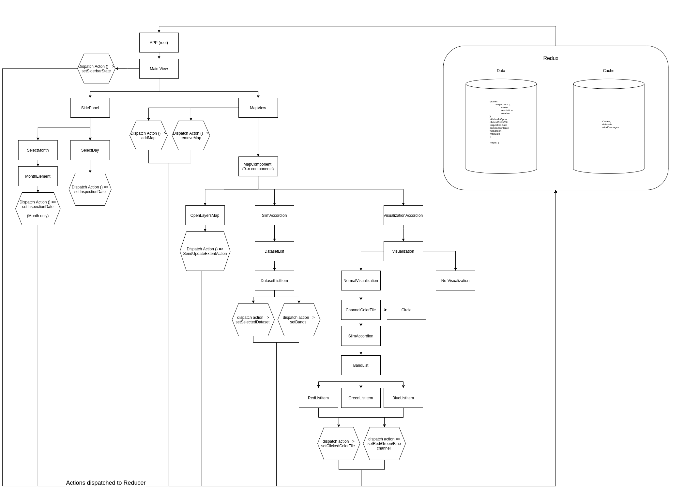

# Tuulituhohaukka APP

This project was bootstrapped with [Create React App](https://github.com/facebook/create-react-app). This readme covers the most used commands, but you can read more about create react app to find other functionality available in this project.

The app is in the directory `app/`. To start developing the app, you need to enter that directory and first install the dependencies: `npm install`

## Devcontainer

This application uses VSCode devcontainers to normalize the development environment. The project may however be developed and built also without devcontainers. However using the devcontainer guarantees that every developer is using the same development and build environment.

You can read more about devcontainers [here](https://code.visualstudio.com/docs/remote/containers).

## Running in development mode

You can run the development server via npm. This will start the server and any changes to the code will be hot deployed into the browser. The process will open a browser window pointing to the development server automatically.

`npm start`

## Building the application

Building the application will combine all necessary javascript dependencies and build a static version of the tool. The results will be in the `build/` folder:

`npm run build`

# Implementation details

## React app

The application uses redux for state management. The react application structure is documented here:

## Dependencies

The application is built with React/Redux and the following key components:
* OpenLayers for maps
* MaterialUI for layout and basic components
* MaterialUI picker for the calendar component
* react-chartjs-2 for a 12-month overall view

## Data sources

Backends and APIs used by the application:
* FMI STAC catalogue built for this application (app/src/API/Api.ts): https://pta.data.lit.fmi.fi/stac/root.json
* Finnish Forest Centre ArcGIS REST for reading the number of wind damage reports (app/src/API/Tuulituhot.ts): https://aineistot.metsakeskus.fi/metsakeskus/rest/services/Metsatieto/MKItuhot/FeatureServer/0/query/

The data for wind damages and the catalogue are read lazily from the APIs when necessary.

## Known problems

To enable the visualisation settings that allow users to choose how bands are visualized, OpenLayers is using WebGL TileLayers. However due to how the features is written in OpenLayers, each TileLayer requires an individual WebGL context. This means that each item visible on a map, OpenLayers uses one WebGL context. These contexts are a limited resource within a browser and this hard limit is shared between all tabs/windows open. This means that having too many items visible (which is especially problematic with Sentine 1 raw imagery, "osakuvat") will cause issues. These issues can range from 1) not all of the items being drawn, 2) other map windows might stop working (due to their context being "stolen" by another window), 3) Tuulituhohaukka interfering with other application in the browser, such as Google Maps, 4) other applications in the browser may interfere with Tuulituhohaukka.

A bug report has been filed with OpenLayers: https://github.com/openlayers/openlayers/issues/12800

